# Noteworthy

```
         ,--. 
       ,--.'| 
   ,--,:  : | 
,`--.'`|  ' : 
|   :  :  | | 
:   |   \ | : 
|   : '  '; | 
'   ' ;.    ; 
|   | | \   | 
'   : |  ; .' 
|   | '`--'   
'   : |       
;   |.'       
'---'         
```

**A powerful Typst framework for creating beautiful, themed educational documents.**

[](https://typst.app/)
[](LICENSE)
[](https://discord.gg/W3S2UQCJzM)

Say hi to **Noteworthy**, an academic parser and framework for creating massive and complex documents in one go. It can be used for building educational textbooks, lecture notes, and technical documentation with Typst. It provides a complete ecosystem of tools, themes, and components that work together seamlessly.

An example project is available at https://github.com/sihooleebd/math-noteworthy. 

## Gallery

<p align="center">
  
  
  
  
</p>

### Themes

<p align="center">
  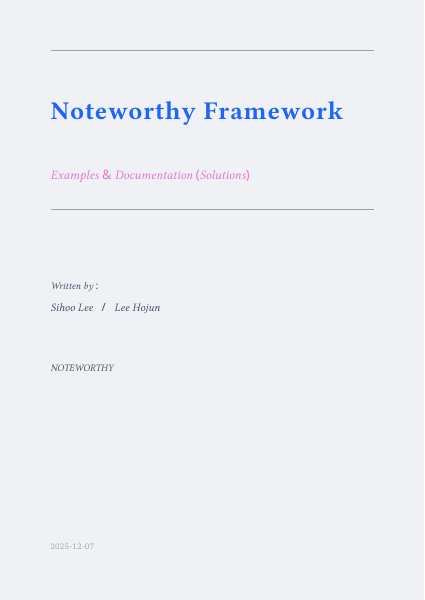
  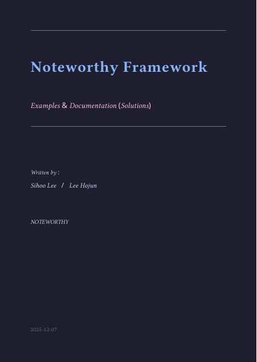
  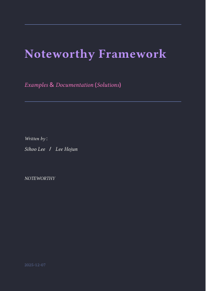
  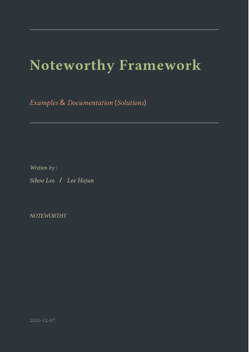
  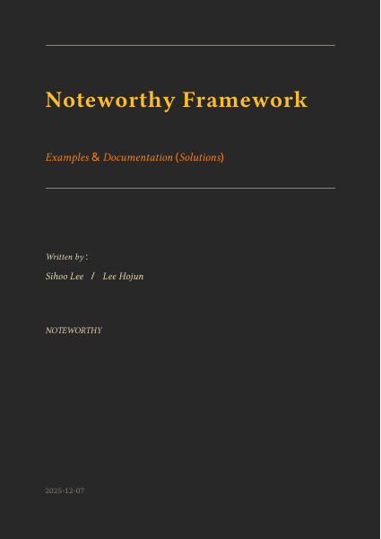
  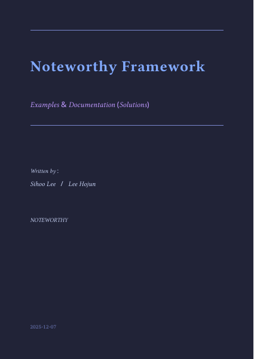
  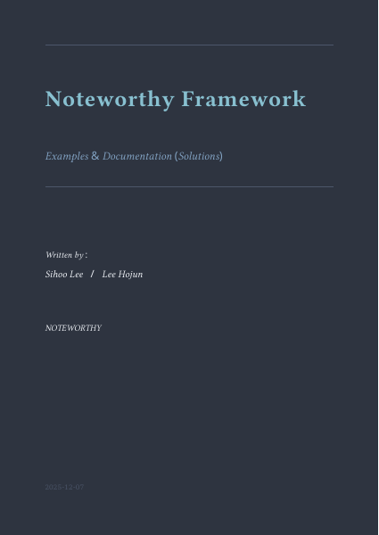
  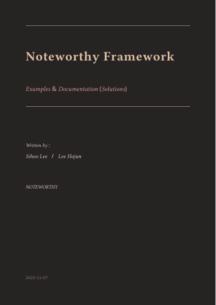
  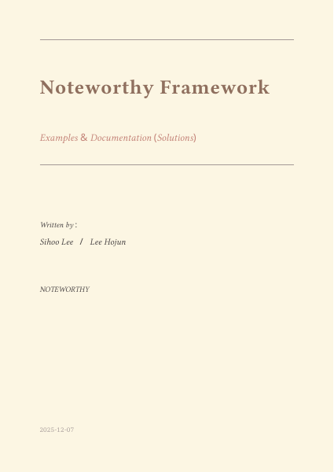
  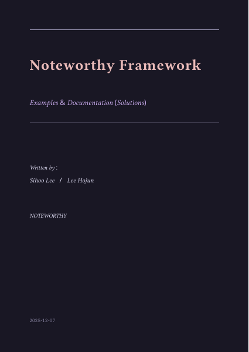
  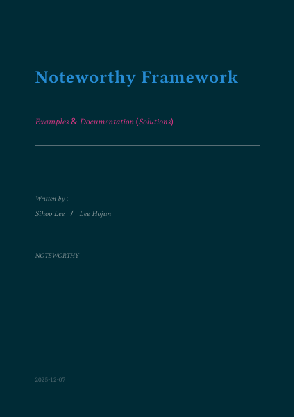
  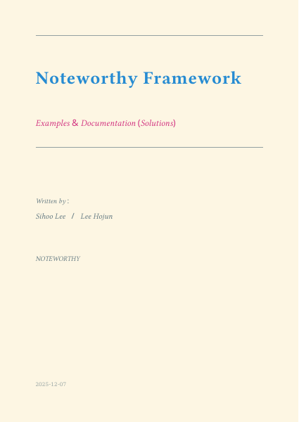
  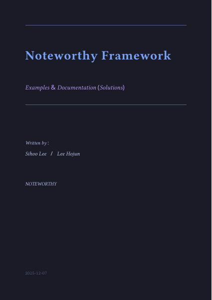
</p>

### Framework Components

- **Theme System**: 13+ pre-built color schemes with easy customization
- **Content Block Library**: Pre-styled components for definitions, theorems, examples, proofs, and solutions
- **Plotting Engine**: Advanced 2D/3D plotting, vector diagrams, and geometric constructions
- **Document Structure**: Automated table of contents, chapter covers, and page headers
- **Configuration Layer**: JSON-based settings in `templates/config/`
- **Build System**: Incremental compilation with automatic PDF merging
- **Interactive Editors**: TUI-based editors for config, hierarchy, schemes, and snippets

## Key Features

- **Theme-Driven Design**: Switch between 13+ themes instantly  
- **Modular Architecture**: Import only what you need
- **Rich Typography**: Beautiful math typesetting with custom snippets
- **Extensible**: Add custom blocks, themes, and plotting functions
- **Production-Ready**: Used for real educational materials
- **Incremental Build**: Compile sections individually, merge automatically

## Quick Start

### Prerequisites

- **Typst** (v0.12.0+): [Install Typst](https://github.com/typst/typst#installation)
- **Python 3**: Required for the build system
- **Poppler** (provides `pdfinfo` for page counting):
  - macOS: `brew install poppler`
  - Linux: `apt-get install poppler-utils`
  - Windows: Download from [poppler releases](https://github.com/oschwartz10612/poppler-windows/releases) and add to PATH
- **PDF Tool** (for merging and metadata):
  - macOS: `brew install pdftk-java`
  - Linux: `apt-get install pdftk`
  - Windows: Download from [pdftk releases](https://www.pdflabs.com/tools/pdftk-the-pdf-toolkit/)
  - *Fallback*: Ghostscript (usually pre-installed on macOS/Linux, [download for Windows](https://ghostscript.com/releases/gsdnld.html))
  
> **Note |** `pdftk` is required for adding PDF metadata (title, author) and clickable bookmarks/outline that appear in the PDF viewer sidebar for easy navigation.

### Installation

```bash
mkdir project
cd project
mkdir content
curl -O https://raw.githubusercontent.com/sihooleebd/noteworthy/master/noteworthy.py
```

### Quickstart

Add the neccesary content for your project and run the build script. The setup wizard will guide you through configuration:

```bash
python3 noteworthy.py
```

The noteworthy system guides you through the initialization, the configuration, and the build. Upon first run, the template will load the necessary template files. 

<p align="center">
  
</p>

**TUI Features:**
- **Chapter Selection**: Toggle individual chapters/sections to compile
- **Options**:
  - `d` - Debug mode (verbose output)
  - `f` - Include/exclude frontmatter (cover, preface, outline)
  - `l` - Keep individual PDFs after merge
  - `c` - Configure custom Typst flags (e.g., `--font-path`)
  - `e` - Open configuration editors
- **Editor Menu** (`e` key):
  - Config Editor - Document settings (title, authors, theme, etc.)
  - Hierarchy Editor - Chapter/page structure with add/delete
  - Scheme Editor - Color themes with create/delete
  - Snippets Editor - Custom macros
  - Preface Editor - Preface content
- **Controls**: Arrow keys to navigate, Space to toggle, Enter to build, `q` to quit
- **Build Progress**: Real-time compilation status with Typst log toggle (`v`)
- **Template Integrity Check**: Verify that the template files are not corrupted and auto fix

#### Interface Preview

<p align="center">
  <strong>Main Menu & Editor Selection</strong><br>
  
  
</p>

<p align="center">
  <strong>Editors</strong><br>
  
  
</p>

<p align="center">
  
  
</p>

<p align="center">
  <strong>Build Process</strong><br>
  
  
</p>

### Single File Compilation

```bash
# Compile specific section
typst compile templates/parser.typ --input target=01.01 section.pdf
```

## Contributing

Contributions are welcome! To contribute:

1. Fork the repository
2. Create a feature branch (`git checkout -b feature/amazing-feature`)
3. Commit your changes (`git commit -m 'Add amazing feature'`)
4. Push to the branch (`git push origin feature/amazing-feature`)
5. Open a Pull Request

## License

MIT License - See [LICENSE](LICENSE) for details.

## Acknowledgments

Built with:
- [Typst](https://typst.app/) - The typesetting system
- [CeTZ](https://github.com/cetz-package/cetz) - Drawing library
- [CeTZ-Plot](https://github.com/cetz-package/cetz-plot) - Plotting extension

## Contact

Created by [Sihoo Lee](https://github.com/sihooleebd) & [Hojun Lee](https://github.com/R0K0R)

---

**Noteworthy** - *A framework for noteworthy educational documents.*
