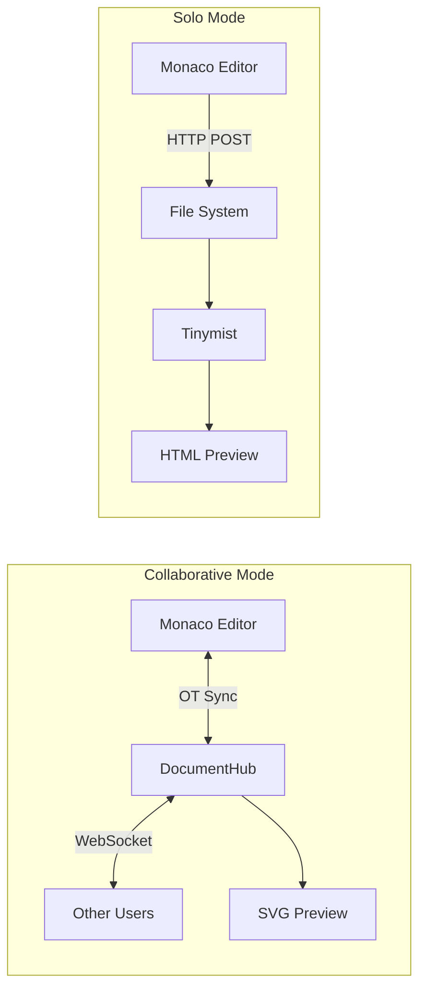
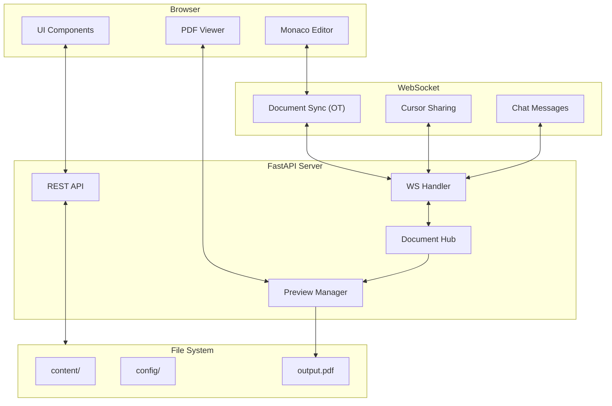
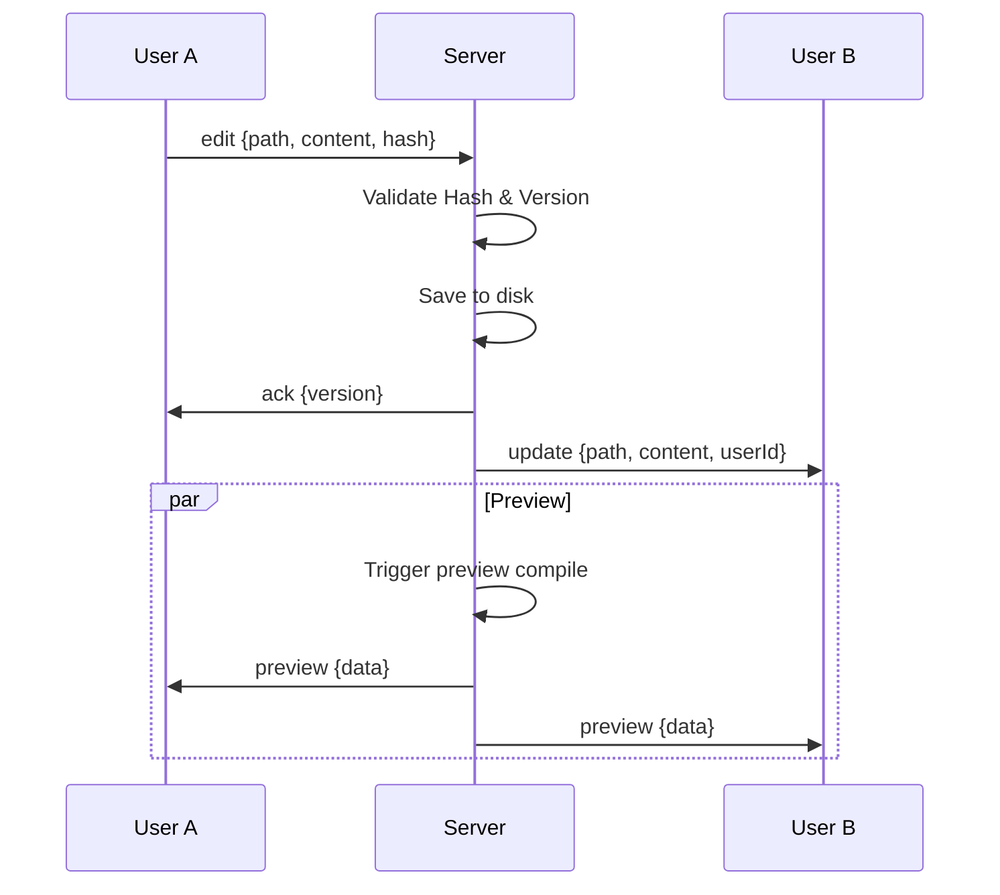
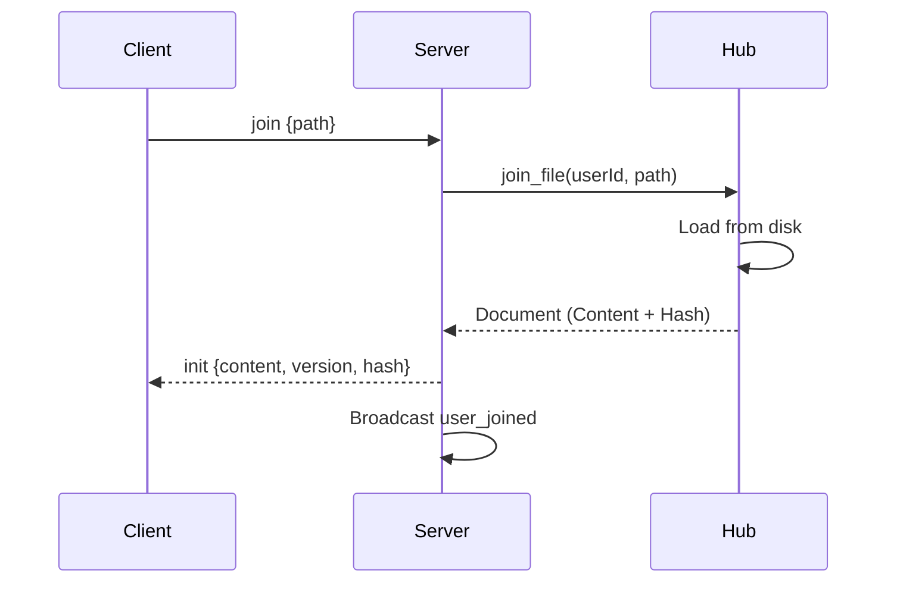

# Noteworthy Studio Stack

Architecture of Noteworthy Studio.

## Overview

Noteworthy Studio is built with:

| Layer         | Technology              |
| ------------- | ----------------------- |
| **Backend**   | FastAPI + Python        |
| **Real-time** | WebSockets              |
| **Frontend**  | HTML + CSS + JavaScript |
| **Editor**    | Monaco Editor + OT Sync |
| **Preview**   | PDF.js / SVG            |


---

## Architecture Variants

Noteworthy Studio runs in two distinct modes:

### 1. Collaborative Mode (Default)
Full feature set with real-time sync.
- **State**: Managed by `DocumentHub` (Server Authority) + `Yjs` (CRDT)
- **Sync**: WebSocket-based Operational Transformation (OT)
- **Communication**: Bidirectional (Cursor, Chat, Selection)

### 2. Solo Mode (`-nc`)
Simplified stack for local-only editing with fast live preview.

| Component        | Technology                                |
| ---------------- | ----------------------------------------- |
| **Backend**      | FastAPI (simplified routes)               |
| **State**        | Direct file system read/write             |
| **Sync**         | HTTP `POST /api/file` (500ms debounce)    |
| **Preview**      | Tinymist HTML preview (fast, auto-reload) |
| **WebSocket**    | One-way (Server → Client) for diagnostics |
| **Chat/Cursors** | Disabled (No collaboration features)      |

**Key Differences from Collaborative Mode:**



**Solo Mode Components:**

| File                         | Purpose                        |
| ---------------------------- | ------------------------------ |
| `gui_solo/server.py`         | Simplified FastAPI server      |
| `gui_solo/static/js/app.js`  | Frontend without collaboration |
| `gui_solo/static/index.html` | UI without chat/cursors        |

**Tinymist Preview Integration:**

Solo mode uses [Tinymist](https://github.com/Myriad-Dreamin/tinymist) for live preview:

1. Server spawns Tinymist process on file open
2. Tinymist serves HTML preview on random port  
3. Frontend embeds preview via iframe
4. Tinymist auto-reloads on file changes (via file watcher)

```mermaid
sequenceDiagram
    participant Editor as Monaco Editor
    participant Server as FastAPI
    participant FS as File System
    participant TM as Tinymist
    participant Preview as Preview iframe

    Editor->>Server: POST /api/file (debounced)
    Server->>FS: Write file
    FS-->>TM: File change detected
    TM->>TM: Recompile
    TM-->>Preview: Auto-reload HTML
```



> [!TIP]
> Solo mode is ideal for single-user editing where fast preview is prioritized over collaboration features.

## Architecture Diagram



---

## Backend Components

### server.py

The main FastAPI application.

**REST Endpoints:**

| Endpoint         | Method   | Purpose           |
| ---------------- | -------- | ----------------- |
| `/api/file`      | GET/POST | Read/write files  |
| `/api/metadata`  | GET/POST | Document metadata |
| `/api/hierarchy` | GET/POST | Chapter structure |
| `/api/schemes`   | GET      | Available themes  |
| `/api/build`     | POST     | Trigger build     |
| `/api/rename`    | POST     | Rename file       |
| `/api/tree`      | GET      | File tree         |
| `/api/modules`   | GET      | Module list       |

**WebSocket Endpoints:**

| Endpoint  | Purpose                    |
| --------- | -------------------------- |
| `/ws/doc` | Unified document WebSocket |

### document_hub.py

Real-time synchronization manager using **Operational Transformation (OT)** logic.

**Responsibilities:**
- User session management
- Document state tracking (Server Authority)
- Hash-based drift detection
- Automatic resync
- Cursor position sharing

**Key Classes:**

```python
@dataclass
class User:
    id: str
    name: str
    color: str
    websocket: WebSocket
    current_file: str
    cursor: tuple

@dataclass  
class Document:
    path: str
    content: str
    content_hash: str  # For drift verification
    version: int
    users: set

class DocumentHub:
    async def connect(ws, name) -> User
    async def join_file(user_id, path) -> Document
    async def update_content(user_id, path, content, client_hash)
    async def update_operation(user_id, path, op)  # New OT handler
    async def verify_sync(path, client_hash)       # Drift check
    async def update_cursor(user_id, line, column)
```

### preview.py

Live preview management.

**Responsibilities:**
- File watching
- Typst compilation
- PDF generation
- Update notifications

```python
class PreviewManager:
    def start_watch(self, path: str)
    def stop_watch(self)
    def compile_preview(self) -> bytes
    def add_callback(self, callback)
```

---

## Frontend Components

### index.html

Main application shell.

### app.js

Application logic:

| Module            | Purpose               |
| ----------------- | --------------------- |
| `EditorManager`   | Monaco editor wrapper |
| `FileTree`        | File navigation       |
| `WebSocketClient` | Real-time connection  |
| `PreviewPanel`    | PDF rendering         |
| `SettingsPanel`   | Configuration UI      |
| `BuildPanel`      | Build grid            |
| `ChatPanel`       | Messaging             |

### styles.css

UI styling with:
- CSS custom properties for theming
- Responsive layout
- Dark/light mode

---

## WebSocket Protocol

### Message Types

**Client → Server:**

| Type        | Payload                 | Purpose             |
| ----------- | ----------------------- | ------------------- |
| `join`      | `{path}`                | Open file           |
| `edit`      | `{path, content, hash}` | Full content update |
| `operation` | `{path, op}`            | OT Operation        |
| `verify`    | `{path, hash, version}` | Period drift check  |
| `cursor`    | `{line, column}`        | Cursor moved        |
| `identity`  | `{name}`                | Set username        |
| `chat`      | `{text, timestamp}`     | Send message        |

**Server → Client:**

| Type          | Payload                    | Purpose              |
| ------------- | -------------------------- | -------------------- |
| `joined`      | `{userId, color, users}`   | Connection confirmed |
| `init`        | `{content, version, hash}` | File content         |
| `ack`         | `{version}`                | Edit acknowledged    |
| `resync`      | `{content, version}`       | Force resync         |
| `update`      | `{path, content, userId}`  | Content changed      |
| `cursor`      | `{userId, line, col, sel}` | Cursor/Selection     |
| `user_joined` | `{user}`                   | New user             |
| `user_left`   | `{userId}`                 | User disconnected    |
| `chat`        | `{userId, name, text}`     | Chat message         |
| `preview`     | `{data}`                   | Preview update       |

---

## Data Flow

### File Edit (OT Sync)



### Join File



---

## Security Considerations

> [!CAUTION]
> Noteworthy Studio has **no authentication**. Anyone with URL access can:
> - Read all files
> - Edit any content
> - See other users' work

**Mitigations:**
- Run on localhost only
- Use ngrok with auth for remote
- Consider VPN for sensitive projects

---

## Performance

### Debouncing

Content syncs are debounced to reduce traffic:
- Editor changes: 300ms debounce
- Cursor updates: 50ms throttle

### Preview Compilation

Preview compiles on:
- File save (not every keystroke)
- Explicit refresh request

---

## See Also

- [Architecture Overview](overview.md)
- [Collaboration Guide](../guides/collaboration.md)
- [Building Guide](../guides/building.md)
