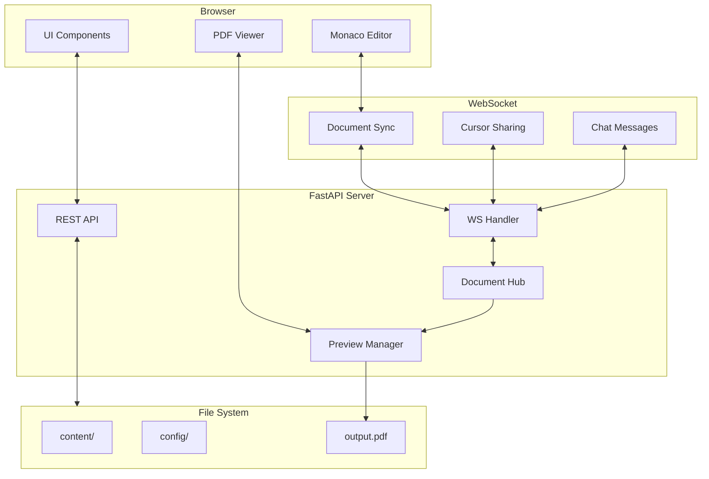
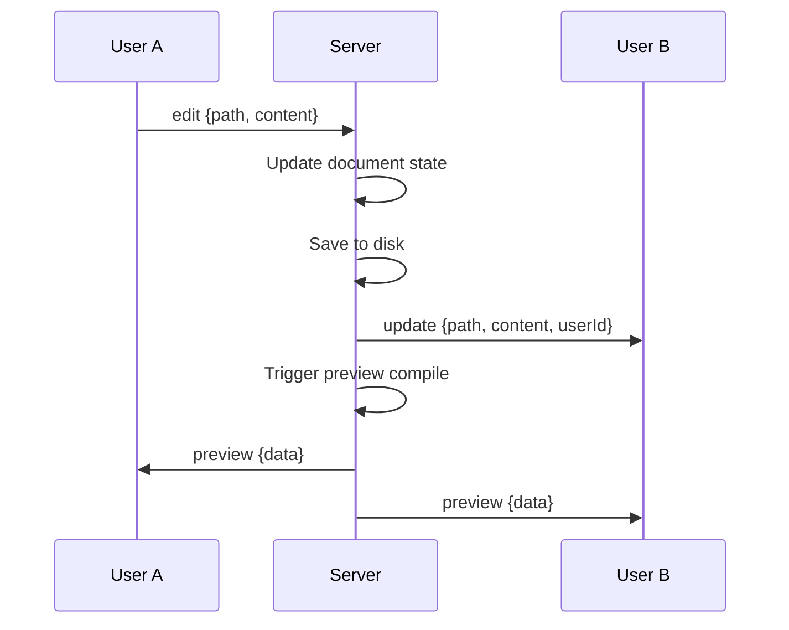
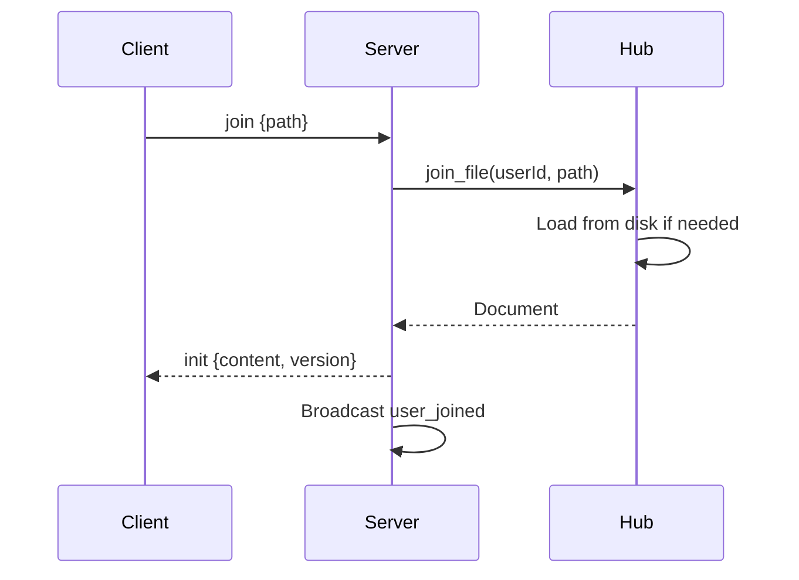

# GUI Stack

Architecture of the Noteworthy web GUI.

## Overview

The GUI is built with:

| Layer         | Technology              |
| ------------- | ----------------------- |
| **Backend**   | FastAPI + Python        |
| **Real-time** | WebSockets              |
| **Frontend**  | HTML + CSS + JavaScript |
| **Editor**    | Monaco Editor           |
| **Preview**   | PDF.js                  |

---

## Architecture Diagram



---

## Backend Components

### server.py

The main FastAPI application.

**REST Endpoints:**

| Endpoint         | Method   | Purpose           |
| ---------------- | -------- | ----------------- |
| `/api/file`      | GET/POST | Read/write files  |
| `/api/metadata`  | GET/POST | Document metadata |
| `/api/hierarchy` | GET/POST | Chapter structure |
| `/api/schemes`   | GET      | Available themes  |
| `/api/build`     | POST     | Trigger build     |
| `/api/tree`      | GET      | File tree         |
| `/api/modules`   | GET      | Module list       |

**WebSocket Endpoints:**

| Endpoint  | Purpose                    |
| --------- | -------------------------- |
| `/ws/doc` | Unified document WebSocket |

### document_hub.py

Real-time synchronization manager.

**Responsibilities:**
- User session management
- Document state tracking
- Cursor position sharing
- Content broadcasting
- Chat message routing

**Key Classes:**

```python
@dataclass
class User:
    id: str
    name: str
    color: str
    websocket: WebSocket
    current_file: str
    cursor: tuple

@dataclass  
class Document:
    path: str
    content: str
    version: int
    users: set

class DocumentHub:
    async def connect(ws, name) -> User
    async def disconnect(user_id, ws)
    async def join_file(user_id, path) -> Document
    async def update_content(user_id, path, content)
    async def update_cursor(user_id, line, column)
    async def send_chat(user_id, text, timestamp)
```

### preview.py

Live preview management.

**Responsibilities:**
- File watching
- Typst compilation
- PDF generation
- Update notifications

```python
class PreviewManager:
    def start_watch(self, path: str)
    def stop_watch(self)
    def compile_preview(self) -> bytes
    def add_callback(self, callback)
```

---

## Frontend Components

### index.html

Main application shell.

### app.js

Application logic:

| Module            | Purpose               |
| ----------------- | --------------------- |
| `EditorManager`   | Monaco editor wrapper |
| `FileTree`        | File navigation       |
| `WebSocketClient` | Real-time connection  |
| `PreviewPanel`    | PDF rendering         |
| `SettingsPanel`   | Configuration UI      |
| `BuildPanel`      | Build grid            |
| `ChatPanel`       | Messaging             |

### styles.css

UI styling with:
- CSS custom properties for theming
- Responsive layout
- Dark/light mode

---

## WebSocket Protocol

### Message Types

**Client → Server:**

| Type       | Payload             | Purpose        |
| ---------- | ------------------- | -------------- |
| `join`     | `{path}`            | Open file      |
| `edit`     | `{path, content}`   | Update content |
| `cursor`   | `{line, column}`    | Cursor moved   |
| `identity` | `{name}`            | Set username   |
| `chat`     | `{text, timestamp}` | Send message   |

**Server → Client:**

| Type          | Payload                   | Purpose              |
| ------------- | ------------------------- | -------------------- |
| `joined`      | `{userId, color, users}`  | Connection confirmed |
| `init`        | `{content, version}`      | File content         |
| `update`      | `{path, content, userId}` | Content changed      |
| `cursor`      | `{userId, line, column}`  | Cursor update        |
| `user_joined` | `{user}`                  | New user             |
| `user_left`   | `{userId}`                | User disconnected    |
| `chat`        | `{userId, name, text}`    | Chat message         |
| `preview`     | `{data}`                  | Preview update       |

---

## Data Flow

### File Edit



### Join File



---

## Security Considerations

> [!CAUTION]
> The GUI has **no authentication**. Anyone with URL access can:
> - Read all files
> - Edit any content
> - See other users' work

**Mitigations:**
- Run on localhost only
- Use ngrok with auth for remote
- Consider VPN for sensitive projects

---

## Performance

### Debouncing

Content syncs are debounced to reduce traffic:
- Editor changes: 300ms debounce
- Cursor updates: 50ms throttle

### Preview Compilation

Preview compiles on:
- File save (not every keystroke)
- Explicit refresh request

---

## See Also

- [Architecture Overview](overview.md)
- [Collaboration Guide](../guides/collaboration.md)
- [Building Guide](../guides/building.md)
