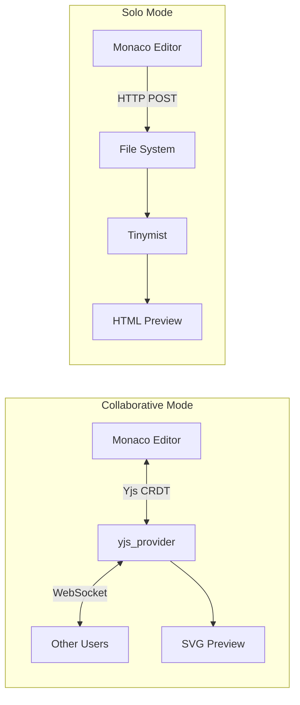
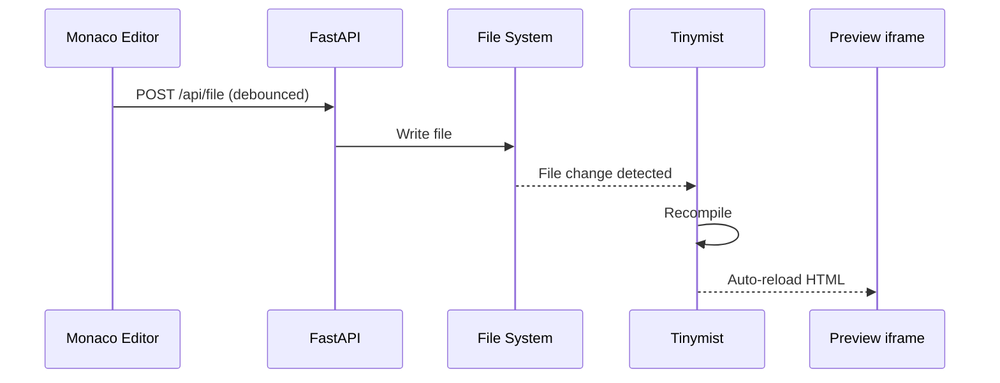
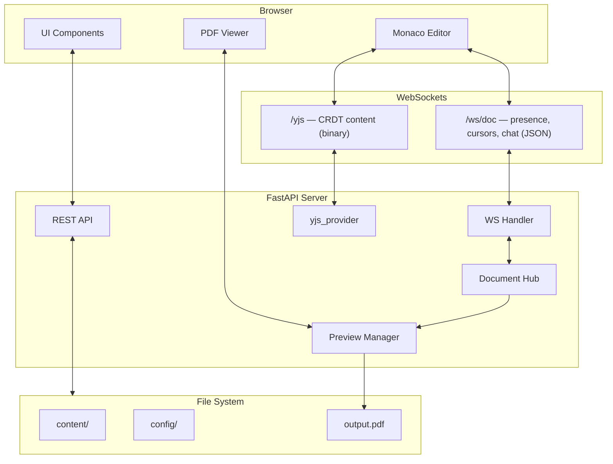
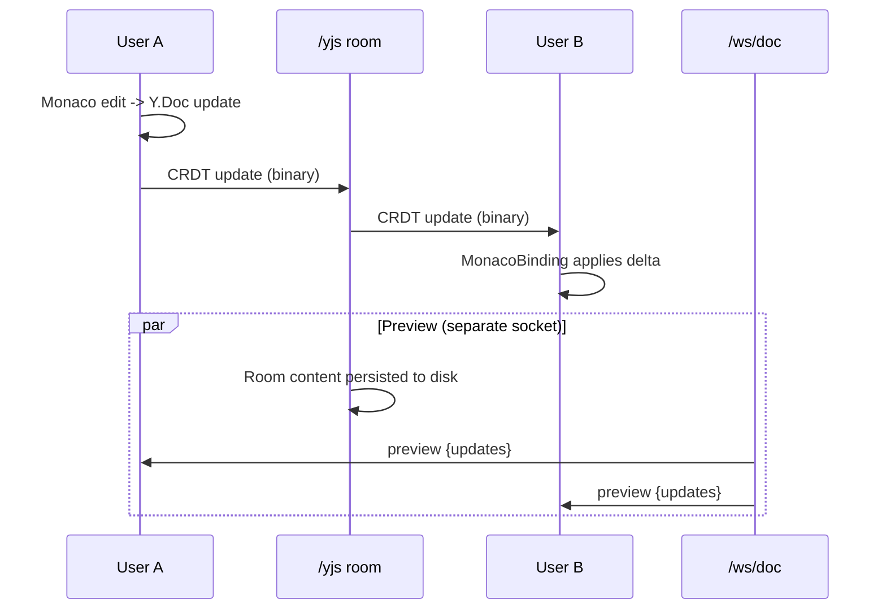
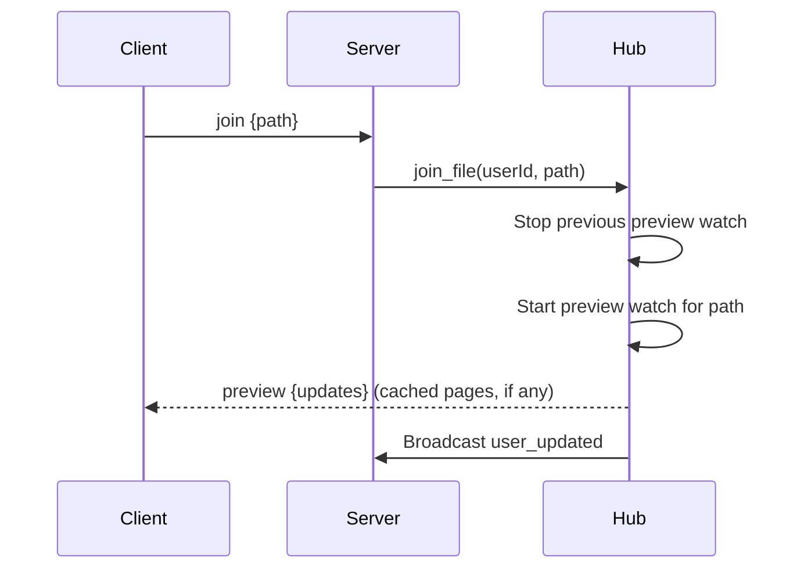

# Noteworthy Studio Stack

Architecture of Noteworthy Studio.

## Overview

Noteworthy Studio is built with:

| Layer         | Technology              |
| ------------- | ----------------------- |
| **Backend**   | FastAPI + Python                                  |
| **Real-time** | Two WebSockets: JSON presence + binary Yjs CRDT   |
| **Frontend**  | HTML + CSS + JavaScript (ES modules)              |
| **Editor**    | Monaco Editor + Yjs (`y-monaco` binding)          |
| **Preview**   | Incremental SVG / Tinymist / PDF.js               |


---

## Architecture Variants

Noteworthy Studio runs in two distinct modes:

### 1. Collaborative Mode (Default)
Full feature set with real-time sync.
- **Content**: `Yjs` CRDT over the binary `/yjs` socket, one room per file
- **Presence**: `DocumentHub` over the JSON `/ws/doc` socket (users, chat, cursors, preview)
- **Split**: The two sockets are strictly separated — `/ws/doc` never carries
  document content, and `/yjs` never carries chat or presence

### 2. Solo Mode (`-nc`)
Simplified stack for local-only editing with fast live preview.

| Component        | Technology                                |
| ---------------- | ----------------------------------------- |
| **Backend**      | FastAPI (simplified routes)               |
| **State**        | Direct file system read/write             |
| **Sync**         | HTTP `POST /api/file` (500ms debounce)    |
| **Preview**      | Tinymist HTML preview (fast, auto-reload) |
| **WebSocket**    | One-way (Server → Client) for diagnostics |
| **Chat/Cursors** | Disabled (No collaboration features)      |

**Key Differences from Collaborative Mode:**



**Solo Mode Components:**

| File                         | Purpose                        |
| ---------------------------- | ------------------------------ |
| `gui_solo/server.py`         | Simplified FastAPI server      |
| `gui_solo/static/js/app.js`  | Frontend without collaboration |
| `gui_solo/static/index.html` | UI without chat/cursors        |

**Tinymist Preview Integration:**

Solo mode uses [Tinymist](https://github.com/Myriad-Dreamin/tinymist) for live preview:

1. Server spawns Tinymist process on file open
2. Tinymist serves HTML preview on random port  
3. Frontend embeds preview via iframe
4. Tinymist auto-reloads on file changes (via file watcher)



> [!TIP]
> Solo mode is ideal for single-user editing where fast preview is prioritized over collaboration features.

## Architecture Diagram



---

## Backend Components

### server.py

The main FastAPI application.

**REST Endpoints:**

| Endpoint                       | Method   | Purpose                       |
| ------------------------------ | -------- | ----------------------------- |
| `/api/file`                    | GET/POST | Read/write files              |
| `/api/tree`                    | GET      | File tree                     |
| `/api/structure`               | GET      | Chapter/page structure        |
| `/api/rename`                  | POST     | Rename file or folder         |
| `/api/delete`                  | POST     | Delete file or folder         |
| `/api/upload`                  | POST     | Upload file                   |
| `/api/metadata`                | GET/POST | Document metadata             |
| `/api/constants`               | GET/POST | Theme and display options     |
| `/api/hierarchy`               | GET/POST | Chapter structure             |
| `/api/preface`                 | GET/POST | Preface content               |
| `/api/snippets`                | GET/POST | Custom snippets               |
| `/api/indexignore`             | GET/POST | Build exclusions              |
| `/api/schemes`                 | GET      | Available themes              |
| `/api/schemes/active`          | GET/POST | Current theme                 |
| `/api/schemes/{name}`          | GET      | Single theme definition       |
| `/api/modules`                 | GET      | Module list                   |
| `/api/modules/{name}/config`   | GET/POST | Per-module settings           |
| `/api/build`                   | POST     | Trigger build                 |
| `/api/check`                   | GET      | Typst diagnostics             |
| `/api/watch`                   | POST     | Start preview watch           |
| `/api/download/output.pdf`     | GET      | Download built PDF            |
| `/api/status`                  | GET      | Server + tinymist status      |
| `/api/tinymist/start`          | POST     | Start full-document preview   |
| `/api/tinymist/stop`           | POST     | Stop full-document preview    |
| `/api/tinymist/status`         | GET      | Tinymist preview status       |
| `/api/debug/yjs`               | GET      | Yjs room introspection        |

**WebSocket Endpoints:**

| Endpoint      | Payload | Purpose                                     |
| ------------- | ------- | ------------------------------------------- |
| `/ws/doc`     | JSON    | Presence, cursors, chat, preview, build log |
| `/yjs/<room>` | Binary  | CRDT content sync, one room per file path   |

> [!NOTE]
> `/ws`, `/ws/collab` and `/ws/sync` still exist but are stubs that close
> immediately on connect. They are retained only so old clients fail cleanly.

### document_hub.py

Presence hub for chat, preview relay and per-file user tracking. It holds **no
document content** — that lives entirely in the Yjs layer, so there is no
server-canonical text, no version counter and no drift/resync machinery.

**Responsibilities:**
- User session management (identity, rotating palette colors, stable tokens)
- Tracking which file each user currently has open
- Starting and stopping preview watchers as users move between files
- Relaying preview output and compiler logs
- Broadcasting chat

**Key Classes:**

```python
@dataclass
class User:
    id: str
    name: str = "Anonymous"
    color: str = "#FF6B6B"
    websocket: WebSocket = None
    current_file: Optional[str] = None
    token: Optional[str] = None   # stable client token (from localStorage)

class DocumentHub:
    async def connect(websocket, name, user_id, token) -> User
    async def disconnect(user_id, websocket=None)
    async def join_file(user_id, path)          # switches preview watcher
    async def send_chat(user_id, text, timestamp)
    async def update_identity(user_id, name)
    async def on_preview_update(updates, source_path)
    async def on_preview_log(level, message, source_path=None)
    def get_users() -> List[dict]
    def get_users_on_file(path) -> List[dict]
```

### yjs_provider.py

Binary CRDT transport backing `/yjs`, built on `pycrdt-websocket`. Each open
file gets a room keyed by its URL-encoded project-relative path. This is the
only component that touches document text on the wire; see the
[Emacs Protocol](../reference/emacs-protocol.md) for the room naming rules.

### preview.py

Live preview management.

**Responsibilities:**
- File watching
- Typst compilation
- PDF generation
- Update notifications

```python
class PreviewManager:
    # Incremental per-page SVG preview
    def start_watch(self, file_path: str)
    def stop_watch(self, file_path: str)
    def get_status(self, file_path: str = None)
    def get_image(self, file_path: str, page_num: int)
    def add_callback(self, cb)
    def add_log_callback(self, cb)
    def cleanup_old_watchers(self, keep_paths: list = None, max_watchers: int = 3)

    # Full-document preview via tinymist (available in both modes)
    def start_full_preview(self, file_path: str = None)
    def stop_full_preview(self)
    def get_full_preview_url(self)
    def get_full_preview_control_url(self)
```

---

## Frontend Components

### index.html

Main application shell.

### app.js

Application shell: Monaco setup, the Yjs provider/binding lifecycle, and
composition of the modules below. Collaborative mode splits its logic into ES
modules under `static/js/modules/`:

| File           | Purpose                                              |
| -------------- | ---------------------------------------------------- |
| `collab.js`    | Doc socket, presence avatars, remote cursors, follow |
| `file_tree.js` | File navigation, rename/move/delete                  |
| `preview.js`   | SVG and tinymist preview panes                       |
| `build.js`     | Build grid, progress, PDF download                   |
| `config.js`    | Metadata, constants, hierarchy, module settings      |
| `chat.js`      | Messaging                                            |
| `utils.js`     | Shared helpers                                       |

> [!NOTE]
> Solo mode keeps everything in a single unmodularized
> `gui_solo/static/js/app.js`. Shared logic is duplicated between the two, so
> frontend fixes generally need applying in both places.

### styles.css

UI styling with:
- CSS custom properties for theming
- Responsive layout
- Dark/light mode

---

## WebSocket Protocol

### Message Types

**Client → Server:**

| Type       | Payload                                                            | Purpose        |
| ---------- | ------------------------------------------------------------------ | -------------- |
| `join`     | `{path}`                                                           | Open file      |
| `identity` | `{name}`                                                           | Set username   |
| `chat`     | `{text, timestamp}`                                                | Send message   |
| `cursor`   | `{file, line, col, selStartLine, selStartCol, selEndLine, selEndCol}` | Cursor moved |

> [!WARNING]
> `edit`, `operation`, `content`, `delta`, `ack` and `resync` are **silently
> discarded** on this socket. They belong to the removed OT protocol; content
> now travels only over `/yjs`.

**Server → Client:**

| Type             | Payload                              | Purpose                    |
| ---------------- | ------------------------------------ | -------------------------- |
| `welcome`        | `{userId, color, users}`             | Connection confirmed       |
| `user_joined`    | `{user}`                             | New user                   |
| `user_left`      | `{userId}`                           | User disconnected          |
| `user_updated`   | `{user}`                             | Name or open file changed  |
| `cursor`         | `{userId, file, line, col, sel*, name, color, token}` | Cursor/Selection |
| `chat`           | `{userId, name, text}`               | Chat message               |
| `preview`        | `{updates: [{page, svg}]}`           | Preview pages rendered     |
| `preview_log`    | `{level, message, source_path}`      | Compiler diagnostics       |
| `build_progress` | `{phase, message}`                   | Build lifecycle events     |

---

## Data Flow

### File Edit (Yjs CRDT)



> [!NOTE]
> No acknowledgement or version negotiation takes place. Concurrent edits
> converge through the CRDT itself, so neither client waits on the server to
> accept an edit.

### Join File



> [!NOTE]
> Joining does **not** deliver file content. The client opens the matching
> `/yjs` room in parallel and receives the text from the CRDT sync step.

---

## Security Considerations

> [!CAUTION]
> Noteworthy Studio has **no authentication**. Anyone with URL access can:
> - Read all files
> - Edit any content
> - See other users' work

**Mitigations:**
- The default `--bind 127.0.0.1` already restricts access to the local machine;
  only widen it deliberately
- Prefer a VPN or Tailscale over a public tunnel — this also gives you HTTPS,
  which browsers require before they will finalize PDF downloads
- If you must use a public tunnel, put authentication in front of it

---

## Performance

### Debouncing

- **Collaborative mode**: content updates are not debounced — Yjs emits compact
  incremental updates per keystroke, which is cheaper than resending documents.
- **Solo mode**: `POST /api/file` is debounced at 500ms, since each save writes
  the whole file.
- **Config panels**: metadata, constants, hierarchy, snippets and preface saves
  are debounced at 1000ms in both modes.

### Preview Compilation

- The SVG watcher recompiles on file change and pushes only changed pages.
- `PreviewManager` keeps at most 3 concurrent watchers
  (`cleanup_old_watchers`), retiring the least recently used.
- Tinymist full preview runs as a separate process on a dynamically chosen
  port (from 23625 upward).

---

## See Also

- [Architecture Overview](overview.md)
- [Collaboration Guide](../guides/collaboration.md)
- [Building Guide](../guides/building.md)
