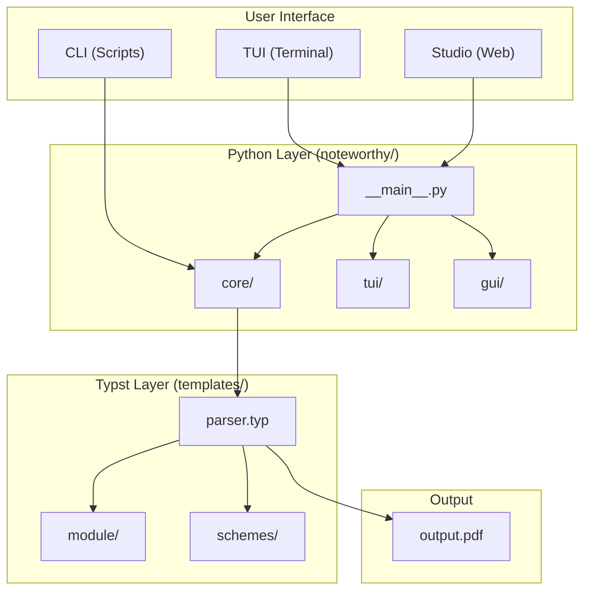
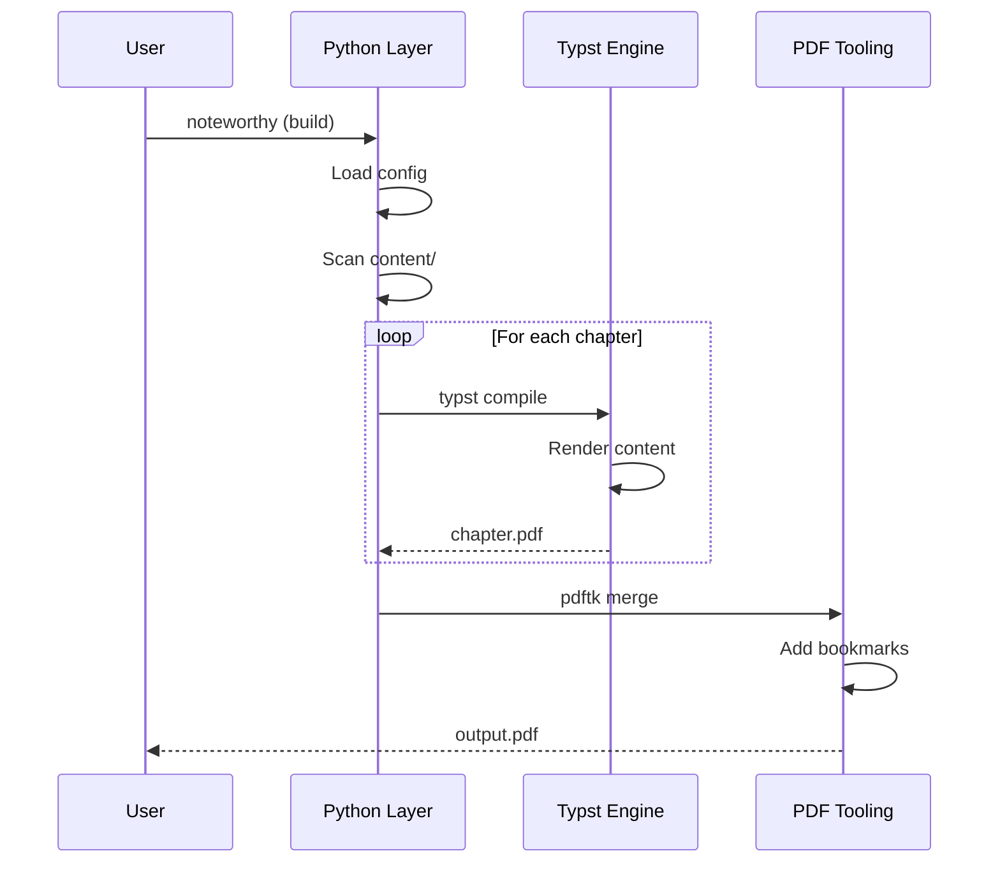

# Architecture Overview

High-level system architecture of Noteworthy.

## System Diagram



---

## Component Overview

Noteworthy is a **hybrid system** combining:

1. **Python Orchestrator** — Build coordination, UI, configuration
2. **Typst Engine** — Document rendering, styling, modules
3. **PDF Tooling** — Merging, metadata, bookmarks

### Data Flow

```
User Input → Python Layer → Typst Compilation → PDF Merge → output.pdf
```

---

## Python Layer

The `noteworthy/` package handles:

| Component     | Purpose                           |
| ------------- | --------------------------------- |
| `__main__.py` | CLI entry point, argument parsing |
| `config.py`   | Path constants                    |
| `utils.py`    | Shared utilities                  |
| `core/`       | Build engine                      |
| `tui/`        | Terminal interface                |
| `gui/`        | Web interface                     |

### Key Modules

| Module                  | Description                  |
| ----------------------- | ---------------------------- |
| `core/build.py`         | Typst compilation logic      |
| `core/build_manager.py` | Parallel build orchestration |
| `core/deps.py`          | Dependency checking          |
| `gui/server.py`         | FastAPI backend              |
| `gui/document_hub.py`   | Real-time sync               |
| `gui/yjs_provider.py`   | Yjs CRDT connector           |

---

## Typst Layer

The `templates/` directory contains:

| Component         | Purpose                |
| ----------------- | ---------------------- |
| `core/parser.typ` | Main compilation entry |
| `core/setup.typ`  | Document configuration |
| `module/`         | Extension modules      |
| `schemes/`        | Theme definitions      |

### Compilation Flow

1. Python invokes `typst compile templates/core/parser.typ`
2. Parser imports setup and modules
3. Content files are rendered with theme
4. Individual PDFs are generated
5. Python merges into final `output.pdf`

---

## Build Process



---

## Integration Points

### Python → Typst

Data passed via CLI flags:

```bash
typst compile parser.typ output.pdf \
  --input chapter-folders='["1","2"]' \
  --input page-folders='{"0":["1","2"]}'
```

### Configuration Files

| File                            | Read By        |
| ------------------------------- | -------------- |
| `config/metadata.json`          | Python & Typst |
| `config/constants.json`         | Python & Typst |
| `config/hierarchy.json`         | Python         |
| `templates/schemes/data/*.json` | Typst          |

---

## See Also

- [Python Layer](python-layer.md)
- [Typst Layer](typst-layer.md)
- [Studio Stack](gui-stack.md)
