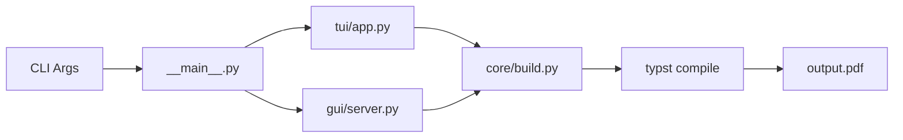

# Python Layer

Deep dive into the `noteworthy/` Python package.

## Package Structure

```
noteworthy/
├── __init__.py
├── __main__.py       # Entry point
├── config.py         # Path constants
├── utils.py          # Shared utilities
│
├── core/             # Build engine
│   ├── build.py
│   ├── build_manager.py
│   ├── config_mgmt.py
│   ├── deps.py
│   ├── fs_sync.py
│   ├── modules.py
│   ├── pm.py
│   ├── sync.py
│   └── templates.py
│
├── tui/              # Terminal UI
│   ├── app.py
│   ├── base.py
│   ├── keybinds.py
│   ├── menus.py
│   ├── components/
│   ├── editors/
│   └── wizards/
│
└── gui/              # Web GUI
    ├── app.py
    ├── server.py
    ├── document_hub.py
    ├── yjs_provider.py
    ├── preview.py
    └── static/
```

---

## Entry Point

### __main__.py

The main entry point handles:

1. **Argument parsing** — `-g`, `-u`, `-p`, etc.
2. **Update logic** — Downloads from GitHub
3. **Mode dispatch** — TUI, Studio, or CLI

```python
def main():
    parser = argparse.ArgumentParser()
    parser.add_argument('-g', '--gui', ...)
    parser.add_argument('-u', '--update', ...)
    args = parser.parse_args()
    
    if args.update:
        # Run update flow
    elif args.gui:
        from .gui.app import run_gui
        run_gui(port=args.port)
    else:
        # Launch TUI
        curses.wrapper(lambda scr: run_app(scr, args))
```

---

## Core Module

### config.py

Defines project path constants:

```python
BASE_DIR = Path.cwd()
BUILD_DIR = BASE_DIR / "build"
OUTPUT_FILE = BASE_DIR / "output.pdf"
METADATA_FILE = BASE_DIR / "config/metadata.json"
CONSTANTS_FILE = BASE_DIR / "config/constants.json"
HIERARCHY_FILE = BASE_DIR / "config/hierarchy.json"
# ...
```

### utils.py

Shared utilities:

| Function             | Purpose                       |
| -------------------- | ----------------------------- |
| `load_config_safe()` | Load JSON with error handling |
| `scan_content()`     | Scan content/ directory       |
| `generate_updater()` | Create update script          |

### core/build.py

Typst compilation logic:

| Function                | Purpose                 |
| ----------------------- | ----------------------- |
| `compile_target()`      | Run `typst compile`     |
| `merge_pdfs()`          | Combine PDFs with pdftk |
| `create_pdf_metadata()` | Generate bookmarks      |
| `apply_pdf_metadata()`  | Apply to PDF            |
| `get_pdf_page_count()`  | Count pages             |

### core/build_manager.py

Parallel build orchestration:

```python
class BuildManager:
    def build_parallel(self, chapters, config, opts, callbacks):
        # Parallel compilation with thread pool
        with ThreadPoolExecutor(max_workers=opts['threads']) as executor:
            futures = [executor.submit(compile_chapter, ch) for ch in chapters]
            # ...
```

### core/deps.py

Dependency checking:

```python
def check_dependencies():
    # Check for typst, pdftk, pdfinfo
    # Return missing dependencies
```

---

## TUI Module

The terminal interface is built with Python's `curses`.

### tui/app.py

Main TUI application loop.

### tui/base.py

Base UI components:

- `Screen` — Base screen class
- `Window` — Windowing abstraction
- `draw_box()` — Box drawing
- `draw_table()` — Table rendering

### tui/menus.py

Menu screens:

| Menu         | Purpose           |
| ------------ | ----------------- |
| `MainMenu`   | Home screen       |
| `BuildMenu`  | Chapter/page grid |
| `ConfigMenu` | Settings access   |

### tui/editors/

Configuration editors:

| Editor            | Edits          |
| ----------------- | -------------- |
| `ConfigEditor`    | metadata.json  |
| `HierarchyEditor` | hierarchy.json |
| `SchemeEditor`    | theme colors   |
| `SnippetsEditor`  | snippets.typ   |
| `BlueprintEditor` | module configs |

### tui/wizards/

Setup wizards:

| Wizard        | Purpose              |
| ------------- | -------------------- |
| `InitWizard`  | First-time setup     |
| `SyncWizard`  | Hierarchy sync       |
| `BuildWizard` | Build selection grid |

---

## Studio Module

The web interface uses FastAPI + WebSockets.

### gui/app.py

Studio launcher:

```python
def run_gui(host="127.0.0.1", port=8000):
    import uvicorn
    from .server import app
    uvicorn.run(app, host=host, port=port)
```

### gui/server.py

FastAPI application with:

- REST API endpoints
- WebSocket connections
- File operations
- Build API

See [Studio Stack](gui-stack.md) for details.

### gui/document_hub.py

Real-time document synchronization:

- User session management
- Cursor tracking
- Content synchronization
- Chat messaging

### gui/yjs_provider.py

Yjs CRDT integration:

- Yjs room management
- CRDT state persistence
- WebSocket broadcasting

### gui/preview.py

Live preview management:

- File watching
- Typst compilation
- PDF generation
- WebSocket broadcast

---

## Data Flow



---

## See Also

- [Architecture Overview](overview.md)
- [Studio Stack](gui-stack.md)
- [CLI Reference](../reference/cli.md)
